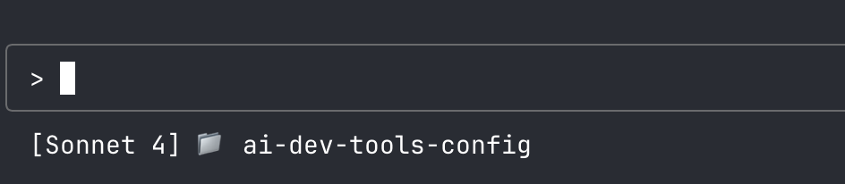

# Claude Code Configuration

A centralized repository for managing configuration files, prompts, and settings for Claude Code.

## Purpose

This repository serves as a single source of truth for Claude Code configurations, enabling:

- **Consistency**: Maintain the same AI behavior and settings across all your projects
- **Version Control**: Track changes to your AI configurations over time
- **Sharing**: Easily share proven configurations with team members
- **Portability**: Quickly set up AI development environments on new machines
- **Experimentation**: Test different configurations without losing working setups

## What's Included

### Pre-configured Agents

- **git-commit-manager**: Analyzes code changes and generates semantic commit messages following conventional commit standards. Handles staging, committing, and ensures atomic commits with meaningful descriptions.

- **project-documentation-keeper**: Maintains your CLAUDE.md file by documenting architectural changes, new features, environment variables, and significant project developments. Proactively keeps documentation in sync with code.

- **test-runner-fixer**: Runs your test suite periodically and intelligently fixes failures while preserving test intent. Distinguishes between legitimate code changes and actual bugs, maintaining test quality and coverage.

- **web-research-specialist**: Researches current documentation, libraries, and best practices from the web. Provides up-to-date technical information with proper sources and implementation examples.

### Other Features
- **Custom Statusline**: Enhanced statusline display showing current model and directory
- **Project Instructions**: CLAUDE.md configurations for context and behavior
- **Custom prompts and templates**: (Coming soon)
- **Hooks**: (Coming soon)

## Statusline Display

This configuration includes a custom statusline that displays the current Claude model and working directory:



The statusline shows:
- Current model name (e.g., `[Claude 3.5 Sonnet]`)
- Directory indicator 📁 with current folder name

## Prerequisites

Before using this configuration, ensure you have the following tools installed:

- **jq**: JSON processor required for statusline parsing
  ```bash
  # macOS with Homebrew
  brew install jq
  
  # Ubuntu/Debian
  sudo apt-get install jq
  
  # Other systems: https://github.com/jqlang/jq/releases
  ```

## How to Use

### 1. Clone this repository
```bash
git clone <your-repo-url> ~/.ai-dev-tools-config
```

### 2. Link configurations to your projects
```bash
# Link the entire .claude directory
ln -s ~/.ai-dev-tools-config/.claude /path/to/your/project/.claude

# Or copy specific files
cp ~/.ai-dev-tools-config/.claude/CLAUDE.md /path/to/your/project/.claude/
cp -r ~/.ai-dev-tools-config/.claude/agents /path/to/your/project/.claude/
```

### 3. Customize for specific projects
- Override specific settings by creating local configuration files
- Use project-specific branches for different configuration sets
- Maintain a base configuration that works across most projects

## Using Agents

Claude Code agents are specialized assistants that can be invoked using the Task tool. You can launch multiple agents concurrently to handle different aspects of your development workflow.

### Example: Concurrent Agent Usage

When you've made significant code changes and want to ensure everything is properly documented, tested, and committed, you can launch multiple agents simultaneously:

```bash
# In Claude Code, you might say:
"I've just finished implementing the new payment processing feature.
Can you run the tests, update the documentation, and prepare a commit?"

# Claude Code will then:
# 1. Launch test-runner-fixer to run and fix any test failures
# 2. Launch project-documentation-keeper to update CLAUDE.md with the new feature
# 3. Launch git-commit-manager to create a semantic commit message
# All three agents work concurrently, saving time and ensuring consistency
```

### Individual Agent Examples

```bash
# Research a new technology
"How do I implement WebSockets in Rails 8?"
# → Launches web-research-specialist

# Document a new feature
"I just added Redis caching with REDIS_URL environment variable"
# → Launches project-documentation-keeper

# Commit your changes
"Please commit these authentication changes"
# → Launches git-commit-manager

# Fix failing tests
"Can you run the test suite and fix any issues?"
# → Launches test-runner-fixer
```

Agents can also work together. For example, the test-runner-fixer might communicate with the project-documentation-keeper to understand feature requirements when fixing complex test failures.

## Structure

```
.
├── .claude/              # Claude Code configurations
│   ├── agents/          # Pre-configured agents
│   │   ├── git-commit-manager.md
│   │   ├── project-documentation-keeper.md
│   │   ├── test-runner-fixer.md
│   │   └── web-research-specialist.md
│   └── CLAUDE.md        # Project context and instructions
└── README.md            # This file
```

## Best Practices

- Keep sensitive information out of shared configurations
- Use descriptive commit messages when updating configurations
- Test configurations in isolated environments before applying broadly
- Document any project-specific customizations needed
